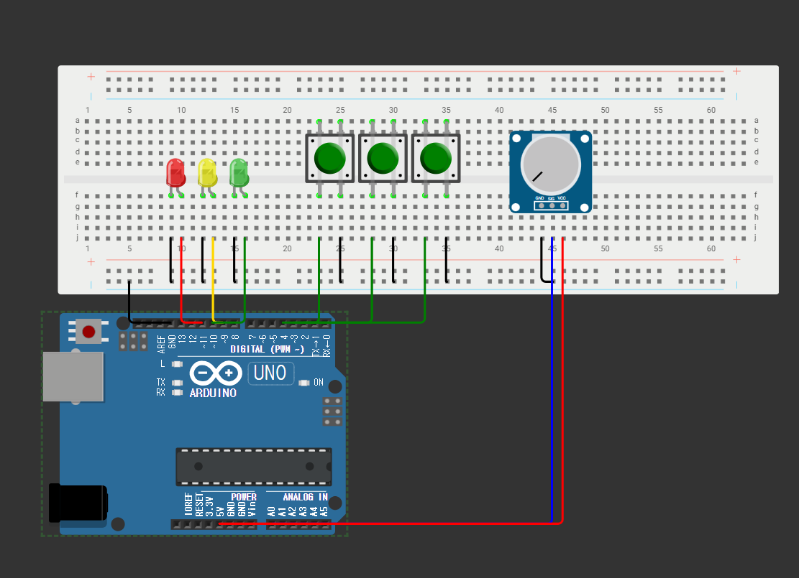

내부 풀업 (Pull-up)을 사용하였다.
내부 풀업이 활성화되어 있을 때 버튼 입력핀은 내부적으로 +5v에 연결되어 있어 HIGH 상태를 유지한다.
버튼이 눌렸을 떄 GND와 연결되므로, 누를 경우 흐름이 LOW 상태로 바뀌게 된다.

버튼 A (Pin 2)
연결: 디지털 핀 2에 연결
동작: 기본 HIGH 상태, 버튼을 누르면 LOW
특징: 버튼 A가 눌리면 LED 시퀀스를 무시하고 빨간 LED만 켜진다.

버튼 B (Pin 3)
연결: 디지털 핀 3에 연결
동작: 기본 HIGH 상태, 버튼을 누르면 LOW
특징: 버튼 B가 눌리면 모든 LED가 깜빡이는 모드로 전환된다.

버튼 C (Pin 4)
연결: 디지털 핀 4에 연결
동작: 기본 HIGH 상태, 버튼을 누르면 LOW
특징: 버튼 C가 눌리면 시스템 전체의 ON/OFF를 토글한다.

LED 회로 (PWM 출력)
사용 핀
빨간 LED (R): PWM 지원 핀 11
노란 LED (Y): PWM 지원 핀 9
초록 LED (G): PWM 지원 핀 10

가변저항 회로 (아날로그 입력)
사용 핀
가변저항의 연결 핀: A0

기본 연결 구성
양쪽 단자: 한쪽은 +5V, 다른 한쪽은 GND에 연결
중앙 단자 (wiper): A0에 연결
